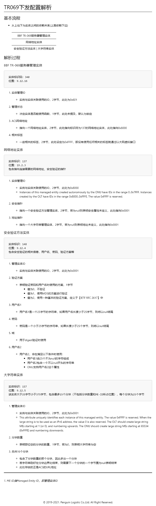

# 需求与设计

## 需求

<del style="background-color:"black"">

- 实现OLT端进行ONU配置地址的下发

1. 地址

    - 下发地址，检查格式

2. 密码

    - 验证密码

3. 用户名

    - 验证用户名，

4. 通告时间

    - 是否设置，设置时包含通告时间间隔，符合规范

5. 路径

    - 下发使用的路径，符合规范
 
6. 端口

    - 下发使用的端口，符合规范

7. WANACL

    - 是否使用ACL？暂不明白

</del>

<a href="#top">

## 设计

</a>

- 根据OMCI协议流程，构建链表，对数据进行逐步处理

